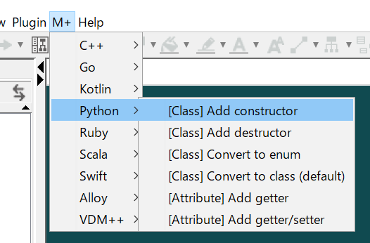

Helper for M PLUS
===

English | [日本語](README_ja.md)

Helper for M PLUS (H4M+) makes settings for [M PLUS](https://sites.google.com/view/m-plus-plugin/download) plug-in at once. For example, the following settings.
* Adding getters and setters of the selected attributes in Python.
* Adding constructors for the selected classes in C++.
* Setting to generate ArrayList type from the selected associations in Kotlin.
* Setting to generate C++11 Smart Pointer from the selected associations in C++.  
  etc.  
   

H4M+ is developed using **Model Driven Development**[^1] approach.  
* The model is described by UML using [Astah](http://astah.net/download).  
* The model is transformed into code using [M PLUS](https://sites.google.com/view/m-plus-plugin/download) plug-in.  
* The code is **Kotlin**.  

[^1]: Model Driven Development (MDD) is a set of software development approaches based on Model Driven Architecture (MDA).

This images are examples of UML diagrams.  

 

******************************

Available for
-------------
* Astah UML and Professional **ver.8.0** or higher.
* M PLUS plug-in **ver.2.3** or higher.

Installation
------------
* **Astah** : Download Astah UML or Professional from [Change Vision site](http://astah.net/download), and install.  
* **M PLUS** plug-in : Download from [M PLUS plug-in site](https://sites.google.com/view/m-plus-plugin/download), and install.  
* **Helper for M PLUS** plug-in : Download from [release page](), and install.  

Usage
-----
1. Select model elements to be set in the Structure Tree.  
2. Select a setting in the Menu Bar.  
3. The model elements are edited.  
 

Development and Building
------------------------
1. Prepare [the Astah plug-in development environment](http://astah.change-vision.com/ja/tutorial/plugin.html#build).  
2. Open `helper-for-m-plus.asta` in [Astah](http://astah.net/download), and edit the model.
3. Generate code using [M PLUS](https://sites.google.com/view/m-plus-plugin/download) plug-in.
4. Open `helper-for-m-plus` directory in [IntelliJ](https://www.jetbrains.com/idea/download/), and edit the code.
5. Execute `astah-build` command on the console.  
A plug-in jar file is created under the `target` directory.

Contributing
------------
We welcome your contributions. Function addition, bug fix, refactoring, etc.  
The procedure is as follows.  

1. Fork the repository and create your branch from master.
2. Develop!  
**Do not include copyrighted model and code** due to the Creative Commons Zero (CC0) license.  
3. Check that the model and code are not separate. The check procedure is as follows.
    1. Select a project element in the Structure Tree of Astah.  
    2. Press the `Generate code` button of M PLUS plug-in.  
    3. Check that the generated code is not updated.  
     
4. Check that the code can be built. The check procedure is as follows.  
    1. Open the Intellij terminal.  
    2. Execute `astah-build` command.  
    3. Check that build succeeded.  
     
5. Issue the pull request!

Licence
-------
Helper for M PLUS (H4M+) is licensed under the Creative Commons Zero (CC0) license.  
The model and code of H4M+ are completely free to use.

