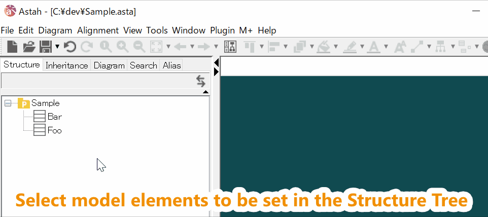

Helper for M PLUS
===

Helper for M PLUS (H4M+) makes settings for [M PLUS](https://sites.google.com/view/m-plus-plugin/download) plug-in at once. For example, the following settings.
* Adding getters and setters of the selected attributes in Python.
* Adding constructors for the selected classes in C++.
* Setting to generate ArrayList type from the selected associations in Kotlin.
* Setting to generate C++11 Smart Pointer from the selected associations in C++.  
  etc.  
   

Available for
-------------
* Astah UML/Professional **ver.8.0** or higher.
* M PLUS plug-in **ver.2.3** or higher.

Installation
------------
* **Astah** : Download Astah UML or Professional from [Change Vision site](http://astah.net/download), and install.  
* **M PLUS** plug-in : Download from [M PLUS plug-in site](https://sites.google.com/view/m-plus-plugin/download), and install.  
* **Helper for M PLUS** plug-in : Download from [release page](https://github.com/takaakit/helper-for-m-plus/releases), and install.  

Usage
-----
1. Select model elements to be set in the Structure Tree.  
2. Select a setting in the Menu Bar.  
3. The model elements are edited.  
 

Licence
-------
Helper for M PLUS (H4M+) is licensed under the Creative Commons Zero (CC0) license.  
The model and code of H4M+ are completely free to use.

