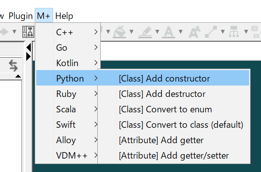
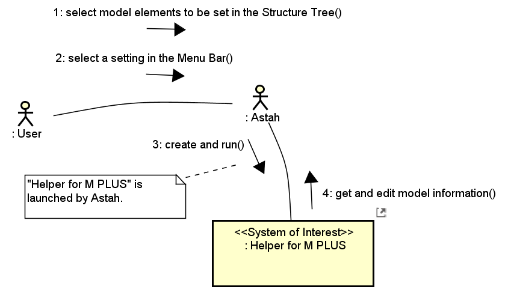
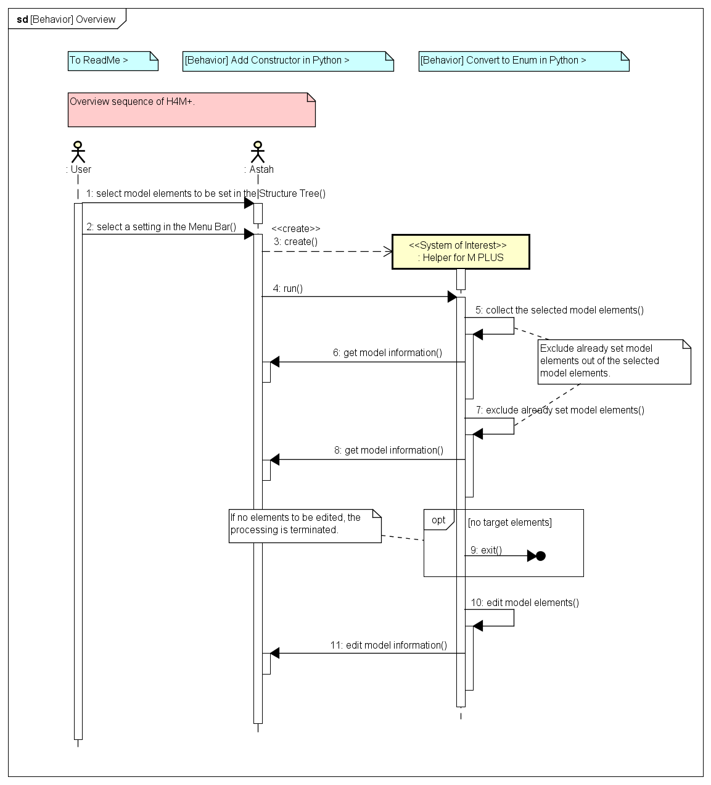
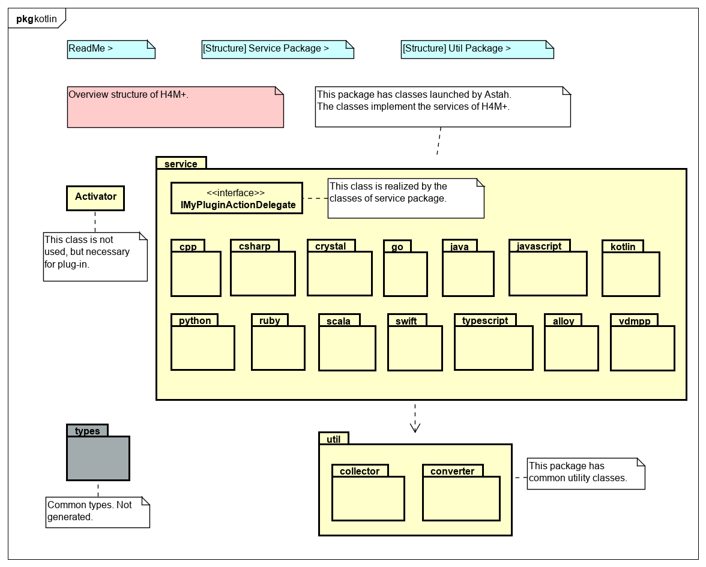
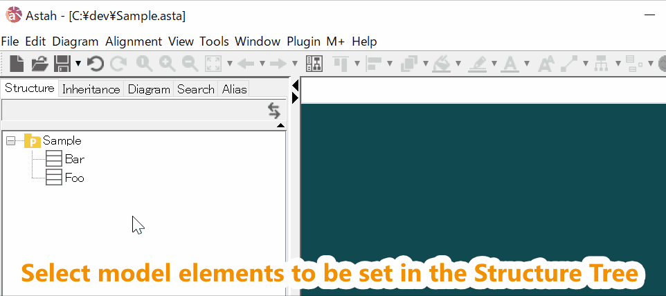
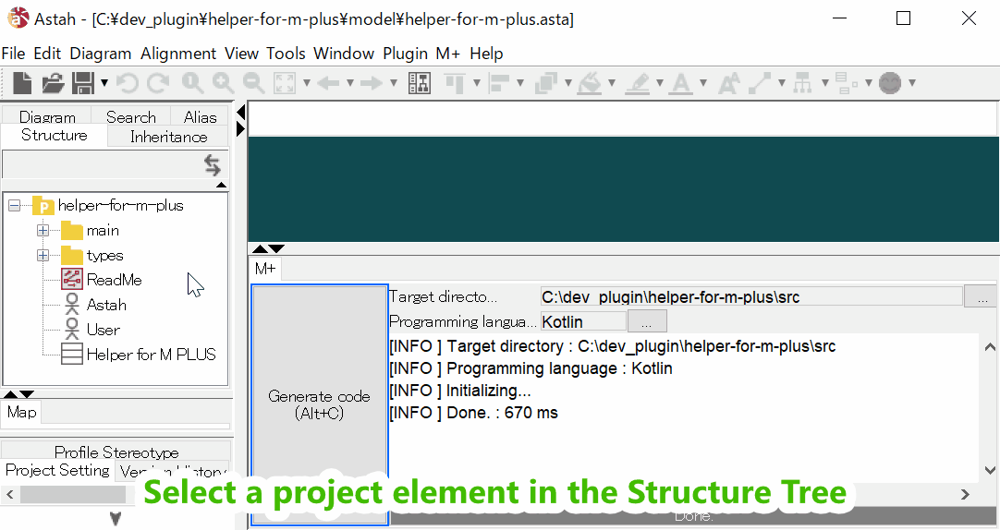
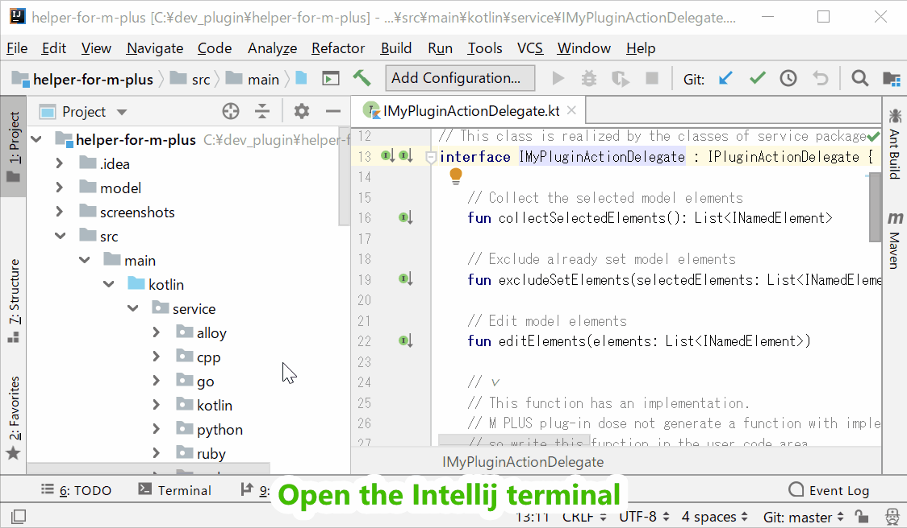

Helper for M PLUS
===

[English](README.md) | 日本語

Helper for M PLUS (H4M+) は、[M PLUS](https://sites.google.com/view/m-plus-plugin/download) プラグインに関する設定を一括で行います。例えば、次のような設定です。
* 選択した属性の getter/setter を追加する（Python）。
* 選択したクラスのコンストラクタを追加する（C++）。
* 選択した関連から ArrayList 型のコードを生成するよう設定する（Kotlin）。
* 選択した関連から C++11 のスマートポインタ型のコードを生成するよう設定する（C++）。  
  など  
   

H4M+ は **モデル駆動** で開発しています。  
* [Astah](http://astah.change-vision.com/ja/download.html) で UML モデルを記述します。  
* [M PLUS](https://sites.google.com/view/m-plus-plugin/download) プラグインでモデルからコードへ変換します。  
* コードは **Kotlin** です。

UML ダイアグラムの例です。  

 

******************************

利用条件
-------------
* Astah UML/Professional **ver.8.0** 以上。 
* M PLUS プラグイン **ver.2.3** 以上。

インストール
-----------
* **Astah** : Astah UML/Professional を [Change Vision サイト](http://astah.net/download) からダウンロードし、インストールする。  
* **M PLUS** プラグイン : [M PLUS plug-in サイト](https://sites.google.com/view/m-plus-plugin/download) からダウンロードし、インストールする。  
* **Helper for M PLUS** プラグイン : [リリースページ](https://github.com/takaakit/helper-for-m-plus/releases) からダウンロードし、インストールする。  

使い方
------
1. 構造ツリー上で、設定を行いたいモデル要素を選ぶ。
2. メニューバーで、行いたい設定を選ぶ。
3. モデル要素に設定が適用される。  
 

開発・ビルド
-----------
1. [Astah のプラグイン開発環境](http://astah.change-vision.com/ja/tutorial/plugin.html#build)を用意する。  
2. [Astah](http://astah.change-vision.com/ja/download.html) で `helper-for-m-plus.asta` ファイルを開き、モデルを編集する。
3. [M PLUS](https://sites.google.com/view/m-plus-plugin/download) プラグインで、コードを生成する。
4. [IntelliJ](https://www.jetbrains.com/idea/download/) で `helper-for-m-plus` ディレクトリを開き、コードを編集する。
5. コンソールで `astah-build` コマンドを実行する。  
プラグインの jar ファイルが `target` ディレクトリ下に作られる。

Contributing
------------
We welcome your contributions. Function addition, bug fix, refactoring, etc.  
The procedure is as follows.  

1. Fork the repository and create your branch from master.
2. Develop!  
**Do not include copyrighted model and code** due to the Creative Commons Zero (CC0) license.  
3. Check that the model and code are not separate. The check procedure is as follows.
    1. Select a project element in the Structure Tree of Astah.  
    2. Press the `Generate code` button of M PLUS plug-in.  
    3. Check that the generated code is not updated.  
     
4. Check that the code can be built. The check procedure is as follows.  
    1. Open the Intellij terminal.  
    2. Execute `astah-build` command.  
    3. Check that build succeeded.  
     
5. Issue the pull request!

ライセンス
-------
Helper for M PLUS (H4M+) は Creative Commons Zero (CC0) ライセンスです。  
H4M+ のモデルとコードは自由に使用できます。

